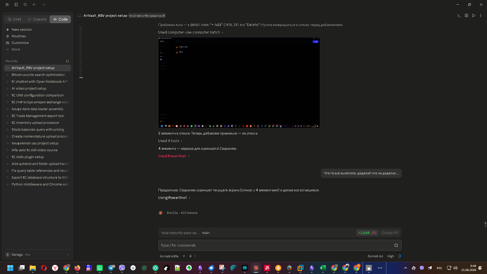
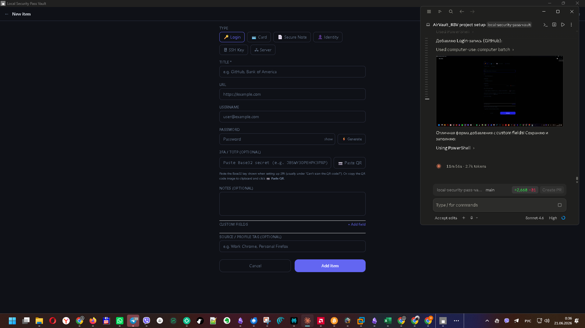
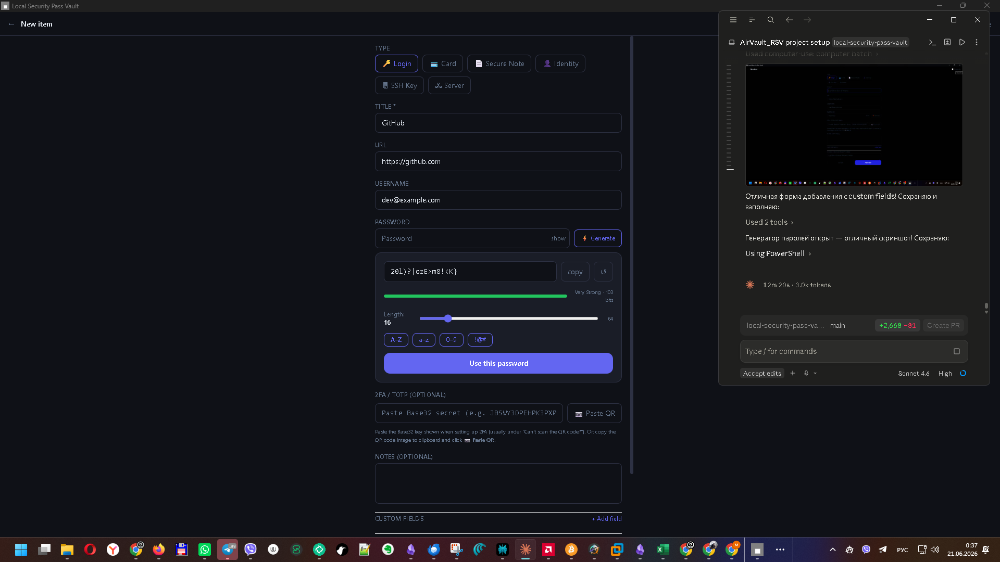
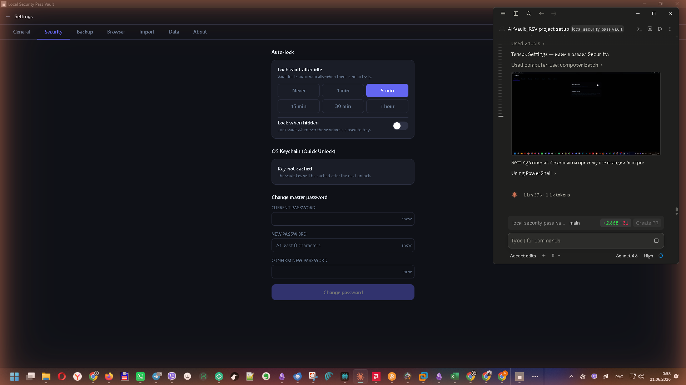
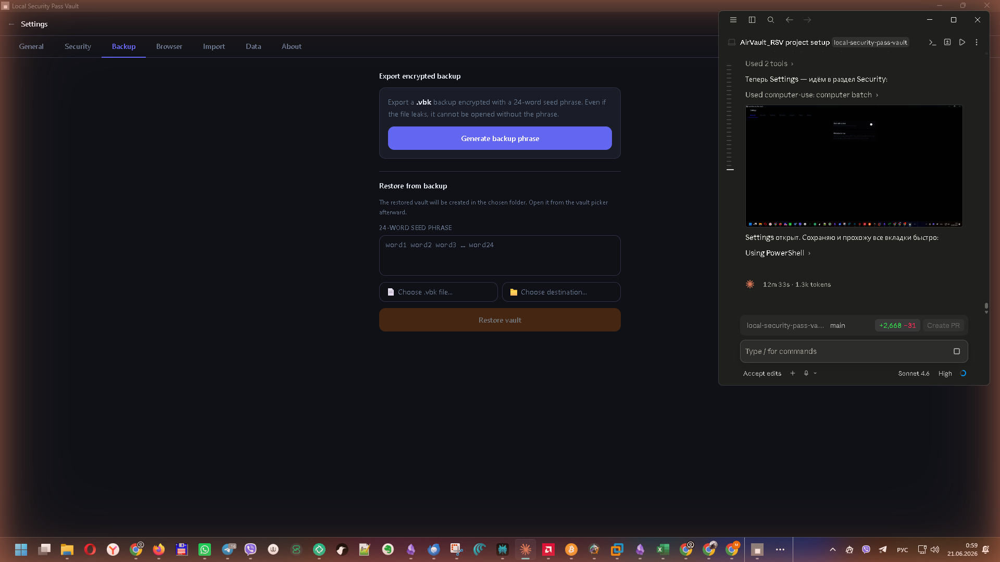
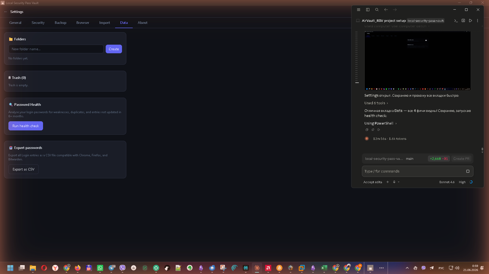
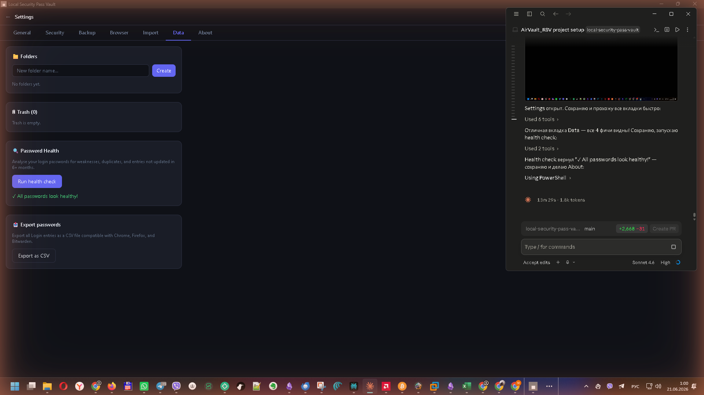
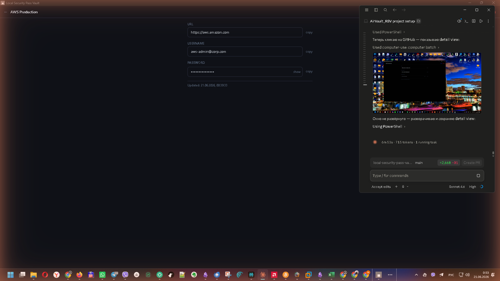
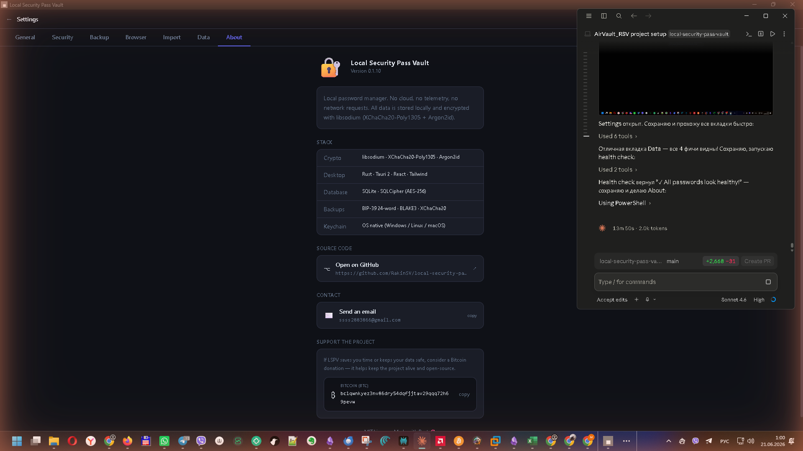

<div align="center">

```
  ╔══════════════════════════════════════════════════════════╗
  ║                                                          ║
  ║   ██╗     ███████╗██████╗ ██╗   ██╗                     ║
  ║   ██║     ██╔════╝██╔══██╗██║   ██║                     ║
  ║   ██║     ███████╗██████╔╝██║   ██║                     ║
  ║   ██║     ╚════██║██╔═══╝ ╚██╗ ██╔╝                     ║
  ║   ███████╗███████║██║      ╚████╔╝                      ║
  ║   ╚══════╝╚══════╝╚═╝       ╚═══╝                       ║
  ║                                                          ║
  ║        Local Security Pass Vault                         ║
  ║                                                          ║
  ║   ══ Zero Cloud · Zero Telemetry · 8 Layers Deep ══     ║
  ║                                                          ║
  ╚══════════════════════════════════════════════════════════╝
```

[](https://github.com/RakinSV/local-security-pass-vault/actions/workflows/security.yml)
[](https://github.com/RakinSV/local-security-pass-vault/releases)
[](LICENSE)
[](docs/adr/)
[](https://github.com/RakinSV/local-security-pass-vault/releases)
[](https://github.com/RakinSV/local-security-pass-vault/actions)

**An open-source, offline-first password manager built in Rust.**  
Your vault never leaves your machine. No subscriptions, no accounts, no cloud, no tracking.

</div>

---

## Screenshots

<div align="center">

| Vault List | Add Login | Password Generator |
|:-----------:|:---------:|:-----------------:|
|  |  |  |

| Settings — Security | Settings — Backup | Settings — Data |
|:-------------------:|:-----------------:|:---------------:|
|  |  |  |

| Password Health Check | Item Detail View | About |
|:---------------------:|:----------------:|:------:|
|  |  |  |

</div>

---

## Why LSPV?

Cloud password managers have a structural problem: they hold your passwords. LastPass was breached in 2022. 1Password, Bitwarden — all viable targets because they centralize what attackers want most.

LSPV takes the opposite approach. The vault never leaves your disk. There is no server to breach. The app makes zero outbound network connections. Your master password runs through Argon2id (256 MB RAM, 4 iterations) so fast-as-GPU brute force attacks are economically infeasible.

---

## Features

### Core Vault
- **Zero cloud, zero telemetry** — no network socket ever opens from the desktop app
- **Offline-first** — works permanently without internet
- **Multi-vault** — separate encrypted databases for work / personal / family
- **6 item types** — Login · Card · Note · Identity · SSH Key · Server
- **Favorites** — star important items, filter sidebar to show only favorites
- **Search** — instant encrypted-index search without decrypting every record
- **Folders** — create folders in Settings → Data, filter vault list by folder in sidebar
- **Source tagging** — import label tracks browser profile or CSV origin; filterable in sidebar

### Security & Password Management
- **Password generator** — configurable length (8–64), uppercase/lowercase/digits/symbols toggles, strength meter with entropy bits
- **TOTP / 2FA** — store TOTP secrets, get live 6-digit codes with countdown ring; scan QR from clipboard
- **Custom fields** — add hidden or visible custom fields to any Login entry (API keys, PINs, recovery codes)
- **Password history** — auto-saved when you change a password; view past passwords with timestamps
- **Password health report** — one-click scan: detects weak (<12 chars or <2 char classes), duplicate, and old (>6 months) passwords
- **Clipboard TTL** — copied passwords auto-cleared after 30 seconds; excluded from Windows Cloud Clipboard sync

### Backup & Recovery
- **BIP-39 backup** — 24-word seed phrase (256-bit entropy); shown once, never stored on disk
- **Encrypted .vbk files** — XChaCha20-Poly1305 + BLAKE3 checksum; brute-force infeasible even at 1000 GPUs
- **Auto-backup rotation** — 7 most recent timestamped copies kept automatically
- **Restore** — paste mnemonic + pick .vbk file + choose destination folder

### Data Management
- **Bitwarden JSON import** — native import from Bitwarden unencrypted exports (logins, secure notes, cards, identities)
- **CSV import** — from Chrome and Firefox password manager exports
- **CSV export** — Chrome/Firefox-compatible format (name, url, username, password, note)
- **Trash bin** — soft-deleted items go to trash; restore or permanently purge individually or all at once
- **Folder management** — create, rename, and delete folders; drag-and-drop items between folders

### Appearance
- **Themes** — Dark, Light, and System modes; switch live in Settings → General
- **Accent colors** — 8 preset accent colors + custom color picker; applied instantly across the entire UI

### Browser Extension
- **Auto-fill** — eTLD+1 domain matching, fills via native setter (not tracked by browser history)
- **Chrome, Edge, Firefox** — local native messaging, no WebSocket, no cloud relay
- **Ed25519 IPC signing** — every native message is signed; extension verifies before acting
- **Zero network** — `connect-src 'none'` CSP; extension cannot phone home

### OS Integration
- **OS Keychain quick-unlock** — Windows DPAPI / macOS Keychain / libsecret (no master password reentry)
- **Auto-lock** — configurable idle timer (1 min / 5 min / 15 min / 30 min / 1 hour / Never)
- **Lock on minimize** — optional; vault key zeroed from memory on window minimize
- **System tray** — minimize to tray, left-click to toggle, right-click for Lock/Quit
- **Autostart** — optional launch at system login

---

## LSPV vs Other Password Managers

| Feature | **LSPV** | Bitwarden | 1Password | LastPass | KeePass | Dashlane | NordPass | Keeper |
|---------|:--------:|:---------:|:---------:|:--------:|:-------:|:--------:|:--------:|:------:|
| Zero cloud storage | ✅ | ❌ | ❌ | ❌ | ✅ | ❌ | ❌ | ❌ |
| Zero telemetry | ✅ | ❌ | ❌ | ❌ | ✅ | ❌ | ❌ | ❌ |
| Works offline forever | ✅ | Limited | ❌ | ❌ | ✅ | ❌ | ❌ | ❌ |
| Free forever | ✅ | Free tier | $3/mo | $3/mo | ✅ | $4.99/mo | $2.99/mo | $2.92/mo |
| Fully open source | ✅ | Partial | ❌ | ❌ | ✅ | ❌ | ❌ | ❌ |
| No account required | ✅ | ❌ | ❌ | ❌ | ✅ | ❌ | ❌ | ❌ |
| Argon2id KDF | ✅ | ✅ | ❌ | ❌ | Plugin | ❌ | ✅ | ❌ |
| XChaCha20 encryption | ✅ | ❌ | ❌ | ❌ | ❌ | ❌ | ✅ | ❌ |
| Static crypto library | ✅ | ❌ | ❌ | ❌ | ❌ | ❌ | ❌ | ❌ |
| TOTP / 2FA codes | ✅ | ✅ | ✅ | ✅ | Plugin | ✅ | ✅ | ✅ |
| Custom fields | ✅ | ✅ | ✅ | ✅ | ✅ | ✅ | ✅ | ✅ |
| Password health report | ✅ | ✅ | ✅ | ✅ | Plugin | ✅ | ✅ | ✅ |
| Trash / soft delete | ✅ | ✅ | ✅ | ✅ | ❌ | ✅ | ✅ | ✅ |
| Folders / Categories | ✅ | ✅ | ✅ | ✅ | ✅ | ✅ | ✅ | ✅ |
| CSV export | ✅ | ✅ | ✅ | ✅ | ✅ | ✅ | ✅ | ✅ |
| Browser extension | ✅ | ✅ | ✅ | ✅ | Plugin | ✅ | ✅ | ✅ |
| BIP-39 backup | ✅ | ❌ | ❌ | ❌ | ❌ | ❌ | ❌ | ❌ |
| Ransomware detection | ✅ | ❌ | ❌ | ❌ | ❌ | ❌ | ❌ | ❌ |
| Mobile app | 🔜 v0.4 | ✅ | ✅ | ✅ | Plugin | ✅ | ✅ | ✅ |
| Breach in history | ❌ | 2023 minor | ❌ | **2022 breach** | ❌ | 2019 breach | ❌ | 2023 breach |

> LastPass 2022 breach exposed encrypted vaults + master password hints. LSPV stores nothing on any server to breach.

---

## Quick Start

### Windows

1. Download `Local Security Pass Vault_0.2.3_x64-setup.exe` from [Releases](https://github.com/RakinSV/local-security-pass-vault/releases)
2. Run the installer — no admin rights required (per-user NSIS install)
3. Launch **Local Security Pass Vault** from the Start menu
4. Click **+ New Vault** and set a strong master password

### Linux

```bash
chmod +x lspv-x86_64.AppImage
./lspv-x86_64.AppImage
```

---

## Security Architecture — 4 Levels

### Level 1 — Cryptographic Core

```
┌─────────────────────────────────────────────────────────────────┐
│  ARGON2ID KEY DERIVATION FUNCTION                               │
│                                                                 │
│  Input:  Master Password  +  32-byte random Salt                │
│  Params: m=256 MB · t=4 iterations · p=4 threads               │
│                                                                 │
│  Output:  ┌─────────────┬─────────────┬──────────────┐         │
│           │  db_key     │  enc_key    │  search_key  │         │
│           │  (32 bytes) │  (32 bytes) │  (32 bytes)  │         │
│           │  SQLCipher  │  Vault Key  │  HMAC index  │         │
│           └─────────────┴─────────────┴──────────────┘         │
│                                                                 │
│  RTX 4090 brute-force cost: ~2-4 seconds per attempt           │
└─────────────────────────────────────────────────────────────────┘

  Envelope Encryption (XChaCha20-Poly1305):
    enc_key  ──► decrypt Vault Key (stored in DB as ciphertext)
    Vault Key ──► encrypt/decrypt every individual record
    Unique 192-bit nonce per record save — never reused

  ✅ Constant-time operations  — sodium_memcmp() for MAC comparison
  ✅ Memory safety             — sodium_mlock() + sodium_memzero() on lock
  ✅ OS Keychain quick unlock  — DPAPI / libsecret / Keychain after first unlock
  ✅ Auto-lock                 — configurable idle timer + lock-on-minimize
```

### Level 2 — Storage Hardening

```
┌─────────────────────────────────────────────────────────────────┐
│  DATABASE: SQLCipher (AES-256 per page)                         │
│    vault.db stolen → reads as random noise without db_key       │
│                                                                 │
│  ATOMIC WRITES: tmp → fsync → rename()                         │
│    Crash mid-write leaves previous vault intact. Always.        │
│                                                                 │
│  FILESYSTEM HARDENING                                           │
│    O_NOFOLLOW — refuses to open symlinks (symlink attack block) │
│    readonly flag when vault is closed                           │
│    honeypot file — unauthorized writes trigger ransomware alert │
│                                                                 │
│  PROCESS-LEVEL PROTECTION                                       │
│    PR_SET_DUMPABLE=0 on Linux — no core dumps, no ptrace attach │
│    libsodium statically linked — zero DLL hijacking surface     │
└─────────────────────────────────────────────────────────────────┘
```

### Level 3 — Browser Extension

```
┌─────────────────────────────────────────────────────────────────┐
│  MV3 MANIFEST — ZERO NETWORK REQUESTS                           │
│    connect-src 'none'  — extension cannot phone home            │
│    frame-src 'none'    — no iframes                             │
│    worker-src 'none'   — no background Workers                  │
│    All data goes via IPC pipe to the desktop process only       │
│                                                                 │
│  ED25519 MUTUAL AUTHENTICATION                                  │
│    Every IPC response signed by desktop private key             │
│    Extension verifies signature before acting on data           │
│    Unique nonce per request — replay attacks impossible         │
│                                                                 │
│  DOMAIN MATCHING — eTLD+1 (tldts library)                      │
│    accounts.google.com ─ match ──► google.com vault entry       │
│    google.com.evil.ru  ─ NO  ──► rejected                      │
└─────────────────────────────────────────────────────────────────┘
```

### Level 4 — Encrypted Backups

```
┌─────────────────────────────────────────────────────────────────┐
│  24-WORD BIP-39 MNEMONIC                                        │
│    256 bits of entropy · standard English wordlist              │
│    Shown ONCE — LSPV never stores it on disk                    │
│                                                                 │
│  BACKUP KDF — HARDENED ARGON2ID PROFILE                        │
│    m = 4 GB RAM · t = 10 iterations · p = 4 threads            │
│    RTX 4090 with 24 GB VRAM → max 6 parallel attempts          │
│    One attempt ≈ 30-60 seconds on high-end GPU                  │
│    2048²⁴ combinations → brute force is physically impossible   │
│                                                                 │
│  .VBK FILE FORMAT: XChaCha20-Poly1305 + BLAKE3 checksum        │
│    Integrity verified on restore — tampered file = hard reject  │
└─────────────────────────────────────────────────────────────────┘
```

### Threat Model (STRIDE/PASTA)

| Attack Vector | LSPV Mitigation |
|---------------|----------------|
| **Stolen vault.db** | SQLCipher AES-256 + XChaCha20-Poly1305 — unreadable blob |
| **RAM dump while locked** | `zeroize` + `mlock` — keys zero-wiped on every lock() |
| **RAM dump while unlocked** | `mlock` prevents swap; AEAD per-record limits blast radius |
| **Brute force master password** | Argon2id 256 MB ≈ 2-4s/attempt even on RTX 4090 |
| **DLL/SO hijacking** | libsodium statically linked — no external DLL surface |
| **GPU VRAM residue (LeftoverLocals)** | `sodium_mlock` + `PR_SET_DUMPABLE=0` documented mitigation |
| **Supply chain (XZ-utils style)** | `cargo audit` in CI · minimal deps |
| **Windows Cloud Clipboard** | `CF_EXCLUDEFROMCLOUDCLIPBOARD` — not synced to MS cloud |
| **Ransomware** | Honeypot file — unauthorized writes trigger vault lock |
| **Symlink attack on vault.db** | `lstat()` + `O_NOFOLLOW` — symlinks refused at open |
| **Browser extension XSS** | `connect-src 'none'` CSP — extension cannot reach internet |
| **IPC pipe squatting** | Ed25519 TOFU mutual auth — unsigned responses rejected |
| **Clipboard sniffing** | 30-second TTL + cloud sync excluded |

Full threat model: [`docs/threat-model.md`](docs/threat-model.md)

---

## Browser Extension

LSPV talks to Chrome/Firefox via the [Native Messaging API](https://developer.chrome.com/docs/apps/nativeMessaging/) — a local named pipe, no WebSocket, no cloud relay.

### Chrome / Edge
1. In LSPV: **Settings → Browser → Chrome/Edge** — paste your extension ID from `chrome://extensions`
2. Click **Apply & Register** — writes native messaging manifest to the registry
3. Load unpacked: `chrome://extensions` → Developer mode → **Load unpacked** → `extension/dist/`

### Firefox
1. **Settings → Browser → Firefox** → click **Add**
2. **Apply & Register**
3. `about:debugging` → This Firefox → **Load Temporary Add-on** → `extension/dist/manifest.json`

---

## Backup & Recovery

> Settings → Backup tab

1. Click **Generate Phrase** — LSPV generates 24 BIP-39 words
2. Write them on paper. LSPV never stores the mnemonic on disk.
3. Tick the checkbox confirming you've written them down
4. Click **Export .vbk** → choose save location

To restore: paste your 24 words → pick the `.vbk` file → choose destination folder.

Auto-backups are saved automatically to `%APPDATA%/lspv/backups/` (Windows) or `~/.local/share/lspv/backups/` (Linux) on every export. The 7 most recent copies are kept.

---

## Build from Source

### Prerequisites

- [Rust 1.96+](https://rustup.rs/) + [Node.js 20+](https://nodejs.org/)
- **Windows:** Microsoft C++ Build Tools (MSVC 2019+)
- **Linux:** `apt install build-essential libwebkit2gtk-4.1-dev libgtk-3-dev libayatana-appindicator3-dev libsecret-1-dev`

### Build

```bash
git clone https://github.com/RakinSV/local-security-pass-vault.git
cd local-security-pass-vault

# Core library + tests
cargo build && cargo test

# Desktop app (release)
cd desktop && npm install && npm run tauri build

# Browser extension
cd ../extension && npm install && npm run build
```

### Development

```bash
cd desktop && npm run tauri dev
```

### Security audit

```bash
cargo audit       # CVE scan of all Rust dependencies
cargo clippy      # Static analysis (-D warnings enforced in CI)
node extension/scripts/sri-check.js   # SRI integrity check on built extension
```

---

## Project Structure

```
local-security-pass-vault/
├── core-vault/          # Rust crate — crypto engine, data model, SQLCipher
│   └── src/
│       ├── crypto/      # Argon2id KDF, XChaCha20-Poly1305, HMAC search index
│       ├── backup/      # BIP-39 + BLAKE3 backup (.vbk format)
│       └── models.rs    # Item types, vault schema
├── desktop/             # Tauri 2 desktop app (Windows + Linux + macOS)
│   ├── src/             # React + Tailwind frontend
│   │   └── pages/       # VaultList, ItemForm, ItemDetail, Settings (all tabs)
│   └── src-tauri/       # Rust — IPC commands, OS Keychain, tray, browser integration
├── extension/           # Browser extension (Chrome + Firefox, Manifest V3)
│   ├── src/
│   │   ├── background/  # Native messaging bridge + Ed25519 signature verification
│   │   ├── content/     # Auto-fill content script
│   │   └── popup/       # React popup
│   └── scripts/         # sri-check.js — build integrity verification
├── docs/
│   ├── adr/             # Architecture Decision Records
│   ├── screenshots/     # App screenshots for documentation
│   └── threat-model.md  # Full STRIDE/PASTA threat model
└── CLAUDE.md            # Development rules + crypto constraints
```

---

## Roadmap

### ✅ v0.2 — Security Hardening (complete)
- ✅ Full backup export/import UI (Settings → Backup: 4×6 word grid, 3-word verify, `.vbk` export)
- ✅ Auto-backup rotation (7 timestamped copies on each export)
- ✅ Auto-lock timer (configurable idle timeout, lock-on-minimize)
- ✅ OS Keychain status UI (Settings → Security: show cache status, Remove button)
- ✅ `PR_SET_DUMPABLE=0` explicitly called at startup on Linux
- ✅ SRI integrity check for browser extension in CI

### ✅ v0.3 — Productivity (complete)
- ✅ **TOTP / 2FA** — live 6-digit codes with countdown ring; QR scan from clipboard
- ✅ **Browser Extension Installer** — auto-detect Chrome/Edge/Firefox/Brave; install with one click
- ✅ **Custom fields** — add hidden or visible custom fields to any Login entry
- ✅ **Password history** — auto-saved on password change; viewable in item detail
- ✅ **Favorites** — star items, sidebar filter
- ✅ **Trash bin** — soft delete with restore/purge; "Empty trash" button
- ✅ **Folders** — create/delete folders; sidebar filter
- ✅ **Password health report** — weak / duplicate / old password detection
- ✅ **CSV export** — Chrome/Firefox-compatible format

### ✅ v0.2.3-beta — UX & Import Improvements (latest)
- ✅ **Folder rename** — inline edit with keyboard confirm (Enter/Esc)
- ✅ **Drag-and-drop** — move vault items into folders via native HTML5 drag-and-drop
- ✅ **Bitwarden JSON import** — native import: logins, secure notes, cards, identities (Settings → Data)
- ✅ **Themes** — Dark / Light / System mode with live switching (Settings → General)
- ✅ **Accent colors** — 8 preset colors + custom color picker; persisted across sessions
- ✅ **Linux CI** — AppImage build via GitHub Actions for every version tag

### 🔜 v0.4 — Mobile
- [ ] **Android app** — Tauri 2 Mobile, same Rust crypto core, same React UI
- [ ] **iOS app** — Tauri 2 Mobile for iPhone/iPad
- [ ] **LAN sync** — vault sync between desktop and mobile, no cloud involved

### 🔜 v0.5 — Hardware Vault
- [ ] **ESP32 hardware key** — vault unlock requires the physical device via USB/BLE
- [ ] **M5StickC Plus2** — standalone portable vault with button-press unlock and BLE output
- [ ] **Breached password check** — local offline check against HaveIBeenPwned SHA-1 hash list

---

## Contributing

PRs welcome. Hard rules:

1. **Crypto code** — read `.claude/rules/crypto.md` before touching `core-vault/src/crypto/`
2. **No new crypto deps** — libsodium only. No `openssl`, `ring`, or `argon2` crates without explicit security review
3. **Tests** — crypto changes require official test vectors (RFC 9106 for Argon2id, libsodium suite for XChaCha20)
4. **No telemetry** — any PR adding outbound network calls will be closed immediately
5. Run `cargo audit` before opening a PR

---

## Support the Project

LSPV is built in spare time, with no funding, no company, and no plan to monetize it. If it's useful to you, consider donating — it helps cover time and infrastructure.

**Bitcoin:**
```
bc1qwnkyez3nv86dry54dqfjjtav29qqq72h69pevw
```

No pressure. A GitHub star costs nothing and also helps.

---

## License

GPL-3.0 — see [LICENSE](LICENSE).

The GPL ensures this stays free and open. If you modify and distribute LSPV, your changes must be open source too.

---

<div align="center">

*Keywords: local password manager · offline password manager · open source password manager · zero knowledge password manager · Rust password manager · self-hosted password manager · no cloud password manager · Tauri password manager · libsodium · SQLCipher · Argon2id · XChaCha20-Poly1305*

</div>
